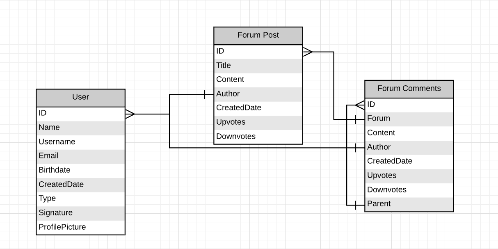

# Forum

## NOTES

### CSS Background Variables
primary-background-color
primary-background-color-light
primary-background-color-dark

primary-background-color-on
primary-background-color-light-on
primary-background-color-dark-on

secondary-background-color
secondary-background-color-light
secondary-background-color-dark

secondary-background-color-on
secondary-background-color-light-on
secondary-background-color-dark-on

big-logo-container-color
light-placeholder-color

## TODO List

- [ ] Refactor all the code
    - [ ] CSS
    - [ ] HTML
    - [ ] PHP

- [ ] Refactor the theme settings
    - [ ] CSS Variables names
    - [ ] Fix background-color color on some elemnets (themes)

- [ ] forum.php: forum-search-bar margin on the sides
- [ ] forum.php: Search bar in desktop view
- [ ] Uniform text input style
- [ ] Uniform button style
- [ ] New post container needs a border

- [ ] view_profile.php: Sorting button not working

- [ ] Fix popups (Click on the side to close it)

- [ ] Tablet view

- [ ] Fix the logo

- [ ] Profile menu when theres one item

- [ ] common/forum.css: Change the error color to a variable
- [ ] forum.php: Change the create new post icon to an font awesome icon 

### Checklist

#### Client Side

- [ ] Mobile View
    - [x] Structure
        - [x] Header
        - [x] Footer
        
- [ ] Tablet View
    - [ ] Structure
        - [ ] Header
        - [ ] Footer

- [ ] Desktop View
    - [ ] Structure
        - [ ] Header
        - [x] Footer

- [ ] Pages
    - [ ] Home
        - [ ] View popular forum posts
    -  [x] Login and Register
        - [x] Form for Login
        - [x] Form for Register
    - [ ] Forum (Posts)
        - [x] Create new post
        - [x] View all posts
        - [x] View a single post
    - [ ] View Post
        - [x] View post content
        - [x] View all post comments and child comments
        - [ ] Create new comments
        - [x] Click on profile name to get a users info
    - [x] View Profile
        - [x] View the user info (Username, Creation Date, Number of posts, Number of comments and more...) 
    - [ ] Settings
        - [ ] Change the theme (Light and Dark)
        - [x] If the user if logged they can change the password
    - [ ] About us
        - [ ] Just info

#### Server Side
- [ ] Login System
- [x] View Forum Posts
- [ ] Create Forum Post

- [ ] Special features for admin and mod users

- [ ] Pages
    - [ ] Home
        - [ ] View popular forum posts
    - [ ] Login and Register
        - [ ] Hook up to the database
        - [x] Form for Login
        - [ ] Form for Register
    - [ ] Forum (Posts)
        - [x] Hook up to the database
        - [ ] Create new post
        - [x] View all posts
        - [x] View a single post
    - [ ] View Post
        - [ ] Hook up to the database
        - [x] View post content
        - [ ] View all post comments and child comments
        - [ ] Create new comments
        - [ ] Click on profile name to get a users info
    - [ ] View Profile
        - [ ] Hook up to the database
        - [ ] View the user info (Username, Creation Date, Number of posts, Number of comments and more...) 
    - [ ] Settings
        - [ ] Hook up to the database
        - [ ] Change the theme (Light and Dark)
        - [ ] If the user if logged they can change the password
    - [ ] About us (No Server side??)

## Tables

Database Design:


p = Primary Key<br>
f = Foreign Key<br>
a = Auto Increment<br>
c = Current Date

### User

| Col Name       | Type     | Enums              |
|----------------|----------|--------------------|
| Id             | Int(p,a) |                    |
| Name           | Varchar  |                    |
| Username       | Varchar  |                    |
| Email          | Varchar  |                    |
| Birthdate      | Datetime |                    |
| CreatedDate    | Datetime |                    |
| Type           | Enum     | Normal, Mod, Admin |
| Signature      | Datetime |                    |
| ProfilePicture | Varchar  |                    |


### Forum Post

| Col Name    | Type        | Foreign Key |
|-------------|-------------|-------------|
| Id          | Int(p,a)    |             |
| Title       | Varchar     |             |
| Content     | MediumText  |             |
| Author      | Int(f)      | Users       |
| CreatedDate | Datetime(c) |             |
| Upvotes     | Int         |             |
| Downvotes   | Int         |             |

### Forum Comment

| Col Name    | Type        | Foreign Key   |
|-------------|-------------|---------------|
| Id          | Int(p,a)    |               |
| ForumID     | Int(f)      | Forum Post    |
| Content     | Varchar     |               |
| Author      | Varchar     | Users         |
| CreatedDate | Datetime(c) |               |
| Upvotes     | Int         |               |
| Downvotes   | Int         |               |

### SQL Code

### 
```sql
```
---

### Design (HTML/CSS)

#### Notes
Responsive (Mobile First)<br>
CSS Grid


#### Header
<blockquote>
Navigation<br>
<br>
More
</blockquote>

#### Content

#### Footer

```html
<h1>Wow</h1>
```
---

### Functionality (PHP)
```php
// Auth API

$database = new Database();
// Regular Query -> DatabaseResult
$result = $database->Query("SELECT * FROM some_table");
// Prepared Statements Query -> DatabaseStatement
$stmt = $database->PrepareQuery("SELECT * FROM some_table");

$stmt->BindParamters();
$stmt->Execute();

$auth = new Auth($database);

// Create User -> AuthUser
$user = $auth->CreateUser(...);
$auth->GetUserById(1);
$auth->GetUserByUsername("Testuser");

$auth->Login($user);

```
---